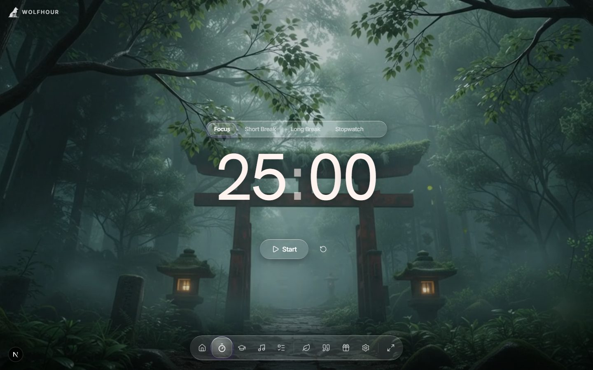
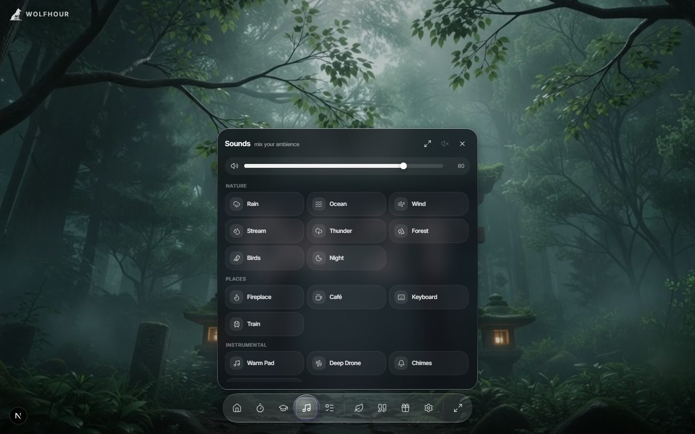
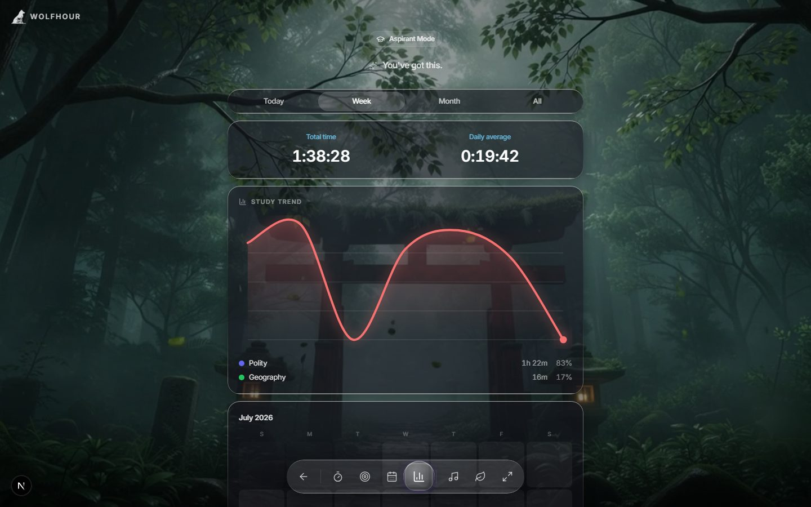

# Wolfhour

**Wolfhour is a free focus timer with live cinematic scenes and layered ambient sounds — a study environment, not just a countdown.**

**Try it live: [wolfhour.vercel.app](https://wolfhour.vercel.app)**



## What it does

Most timers give you a number counting down over a blank page. Wolfhour gives you a place: a live cinematic backdrop, a soundscape you mix yourself, and a timer that stays calm — a soft two-note chime when time's up, no jarring buzzer.

### Pomodoro timer
Classic 25/5/15 focus blocks plus a count-up stopwatch, one tap apart. The timer sits inside your scene, not on top of a settings maze.

### Soundscape mixer
22 sounds across five groups — Nature (rain, ocean, thunder, forest…), Places (fireplace, café, keyboard, train), Instrumental, Lo-Fi, and Noise (white/pink/brown). Nearly all are synthesised live in the browser with the Web Audio API, so there's no loop seam to catch your ear and no audio files to download. Layer them with independent volumes and save the blend.



### Aspirant mode
Study tracking for people with an exam date. Per-subject stopwatches, daily/weekly/monthly goals, an exam countdown, a study calendar with streaks, and analytics with a day-by-day trend chart — so a flatlining subject is visible, not hidden inside one reassuring total.



### Works offline
Installable as a PWA. A library with bad Wi-Fi doesn't cost you a session; your stats sync across devices when you're back online.

## Tech stack

- [Next.js 16](https://nextjs.org) (App Router, Turbopack) — every page statically prerendered
- [Supabase](https://supabase.com) — auth and cross-device sync
- [Zustand](https://zustand-demo.pmnd.rs) — local-first state with persistence
- Web Audio API — real-time synthesised soundscapes
- Deployed on [Vercel](https://vercel.com)

## Run locally

```bash
npm install
npm run dev
```

Open [http://localhost:3000](http://localhost:3000).

## Links

- **App:** [wolfhour.vercel.app](https://wolfhour.vercel.app)
- [Pomodoro timer](https://wolfhour.vercel.app/pomodoro-timer) · [Study sounds](https://wolfhour.vercel.app/study-sounds) · [Aspirant mode](https://wolfhour.vercel.app/aspirant-mode)
